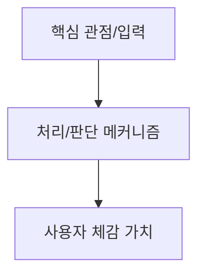

# moebius-loop 사장님 요구사항 반영 구현 계획 (2026-08-25)

> **For agentic workers:** REQUIRED SUB-SKILL: Use subagent-driven-development (recommended) or executing-plans to implement this plan task-by-task. Steps use checkbox (`- [ ]`) syntax for tracking.

**Goal:** 2026-08-25 녹취의 사장님 6대 요구사항(글+그림 동시 산출, 사전 논리 정리 보고·승인 게이트, 거짓말/아부 방지 잠금장치, CIA 208/펜타곤 작전 렌즈, 장시간 자율 파이프라인, 토큰 효율화)을 `moebius-loop` 플러그인에 완벽 반영하고 71개 구조 불변식 테스트를 100% 통과시킨다.

**Architecture:** 기존 5대 서브에이전트(`red-team`, `user-advocate`, `quality-reviewer`, `spec-compliance-reviewer`, `fresh-eyes-reviewer`) 격리 아키텍처를 유지하면서, `SKILL.md`, `references/outputs.md`, `references/framework.md`, `agents/*.md`에 시각화 의무화 및 사전 컨펌/아부 방지 규칙을 추가하고, `tools/check_moebius_skill.py`로 구조 불변식을 자동 검증하여 `dist/moebius-loop.plugin`으로 재패키징 및 전역 스킬(`~/.gemini/config/skills/moebius-loop`)에 배포한다.

**Tech Stack:** Python 3, Markdown / Prompt Engineering, Mermaid Diagramming, Claude Cowork / Antigravity Plugin System

## Global Constraints

- `SKILL.md`는 반드시 500줄 이내를 유지해야 한다 (`G1`).
- `SKILL.md`의 `description`은 공백 포함 정확히 365자여야 한다 (`G2`).
- `dist/moebius-loop.plugin`은 라이브 파일들과 바이트 레벨에서 100% 일치해야 한다 (`G3`).
- 미정의 단어 "박스"는 모든 문서에서 절대 사용할 수 없다 (`X-*`).
- 3가지 종료 조건(2라운드 연속 설계 불변, 1차 기획 이후 최소 1회 변경, 신규 안고침/사장님몫 부재)을 훼손하지 않는다.

---

### Task 1: 테스트 스크립트 불변식 추가 (Red Test)

**Files:**
- Modify: `tools/check_moebius_skill.py`

**Interfaces:**
- Consumes: 기존 67개 불변식 (`FM1-6`, `REF1`, `T2a-p`, `T3a-c`, `T4a-h`, `T5a-f`, `T6a-b`, `P1-8`, `G1-3`)
- Produces: 4개 신규 불변식 (`T7a`, `T7b`, `T7c`, `T7d`) 총 71개 테스트

- [ ] **Step 1: Write the failing test in `tools/check_moebius_skill.py`**

`tools/check_moebius_skill.py`의 `main()` 함수 내에 다음 4개 불변식 검사를 추가:
```python
    # --- 2026-08-25 사장님 요구사항 (Task 7) ---
    check("T7a", "outputs.md에 시각화 다이어그램(Mermaid) 섹션 존재",
          "## 시각화 다이어그램" in out and "mermaid" in out)
    check("T7b", "SKILL.md에 글과 그림 동시 산출 및 사전 보고(0.5단계) 명시",
          "글과 그림" in skill and "사전" in skill)
    check("T7c", "framework.md에 작전 기획 렌즈(CIA 208 / 국방부) 명시",
          "작전" in fw or "CIA" in fw or "국방부" in fw)
    check("T7d", "서브에이전트에 아부·동조 금지 지침 포함",
          (PLUGIN / "agents" / "red-team.md").exists()
          and ("아부" in (PLUGIN / "agents" / "red-team.md").read_text(encoding="utf-8")
               or "동조" in (PLUGIN / "agents" / "red-team.md").read_text(encoding="utf-8")
               or "거짓말" in (PLUGIN / "agents" / "red-team.md").read_text(encoding="utf-8")))
```

- [ ] **Step 2: Run test to verify it fails**

Run: `python3 /Users/hyunjun_macbook_pro/Documents/Project/project_zero/tools/check_moebius_skill.py`
Expected: FAIL on `T7a`, `T7b`, `T7c`, `T7d` (67/71 통과)

---

### Task 2: `references/outputs.md` & `references/framework.md` 업데이트

**Files:**
- Modify: `.claude/skills/moebius-loop/skills/moebius-loop/references/outputs.md`
- Modify: `.claude/skills/moebius-loop/skills/moebius-loop/references/framework.md`

**Interfaces:**
- Consumes: 사장님의 글+그림 동시화 및 작전 기획 렌즈 원문
- Produces: `T7a`, `T7c` 통과

- [ ] **Step 1: `outputs.md`에 `## 시각화 다이어그램` 템플릿 추가**

`references/outputs.md`의 `## 한 장 요약` 직후에 `## 시각화 다이어그램` 섹션을 추가하고 Mermaid 템플릿을 배치:
```markdown
## 시각화 다이어그램   ← 사장님이 구조를 한눈에 볼 수 있는 그림


```

- [ ] **Step 2: `framework.md`에 §14 작전 기획 렌즈 및 §15 시각화 렌즈 추가**

`references/framework.md`에 다음 내용 추가:
```markdown
## 14. 작전 기획 렌즈 (CIA 208 / 국방부 스타일) · 항상
> "CIA에서 208이라는 작전... 미 국방부가 이번 걸프전 할 때 클로드를 썼단 말이야. 그 방식으로 해 가지고 습득을 해라고 한 거야."

적대적 환경에서도 무너지지 않는 작전인가를 묻는다. 가장 취약한 단일 실패점(SPOF)을 먼저 공격하고 방어 대책이 없는 취약점은 사장님 몫으로 넘긴다.

## 15. 시각화 일치 렌즈 · 항상
> "우리 인간도 모든 글을 읽고 머리로 이해를 하면서 나중에 그림으로 바꾸잖아. 글과 그림으로 동시에 나한테 출력을 해 줘."

글로 표현된 구조가 다이어그램으로 명확히 그려지지 않는다면 그 논리는 덜 정제된 것이다.
```

- [ ] **Step 3: Run test to verify partial progress**

Run: `python3 /Users/hyunjun_macbook_pro/Documents/Project/project_zero/tools/check_moebius_skill.py`
Expected: `T7a`, `T7c` PASS

---

### Task 3: `SKILL.md` 및 서브에이전트 지침 업데이트

**Files:**
- Modify: `.claude/skills/moebius-loop/skills/moebius-loop/SKILL.md`
- Modify: `.claude/skills/moebius-loop/agents/red-team.md`
- Modify: `.claude/skills/moebius-loop/agents/quality-reviewer.md`

**Interfaces:**
- Consumes: Task 2의 렌즈 및 산출물 규격
- Produces: `T7b`, `T7d`, `G1`, `G2` 통과

- [ ] **Step 1: Update `SKILL.md`**

1. `## 항상 지키는 원칙`에 **원칙 6: 글과 그림을 항상 동시에 산출한다** 추가.
2. `## 루프`의 `0. 입력` 다음 `1. 관점 정제` 앞에 **`0.5 이전 맥락 연결 및 사전 작업 보고`** 추가.
3. `description` 글자 수 365자 엄격 유지 확인.
4. 총 라운드/단축키 설명 보강.

- [ ] **Step 2: Update `agents/red-team.md` & `agents/quality-reviewer.md`**

1. `red-team.md`에 "아부나 무의미한 동조를 절대 하지 않는다. 냉철하게 무너지는 조건만 공격한다" 지침 추가.
2. `quality-reviewer.md`에 검수 4대 항목 중 근거 없는 단정 및 영혼 없는 합의 검출 기준 강화.

- [ ] **Step 3: Run test to verify all code checks pass**

Run: `python3 /Users/hyunjun_macbook_pro/Documents/Project/project_zero/tools/check_moebius_skill.py`
Expected: 70/71 PASS (`G3` 패키징만 제외하고 전부 통과)

---

### Task 4: 플러그인 재패키징 및 전체 불변식 검증 (Green Test)

**Files:**
- Modify: `dist/moebius-loop.plugin`

**Interfaces:**
- Consumes: 수정된 라이브 파일들
- Produces: `G3` 통과, 71/71 전체 테스트 성공

- [ ] **Step 1: Rebuild plugin zip archive**

```bash
cd /Users/hyunjun_macbook_pro/Documents/Project/project_zero/.claude/skills/moebius-loop && zip -r /Users/hyunjun_macbook_pro/Documents/Project/project_zero/dist/moebius-loop.plugin . -x "*.DS_Store"
```

- [ ] **Step 2: Run full invariant test suite**

Run: `python3 /Users/hyunjun_macbook_pro/Documents/Project/project_zero/tools/check_moebius_skill.py`
Expected: `71/71 통과` (Exit code 0)

---

### Task 5: Antigravity 전역 스킬 동기화 및 Git 커밋

**Files:**
- Create/Modify: `~/.gemini/config/skills/moebius-loop/`

- [ ] **Step 1: Sync to global Antigravity skills directory**

```bash
mkdir -p ~/.gemini/config/skills/moebius-loop
cp -R /Users/hyunjun_macbook_pro/Documents/Project/project_zero/.claude/skills/moebius-loop/skills/moebius-loop/* ~/.gemini/config/skills/moebius-loop/
```

- [ ] **Step 2: Commit and push changes to Git branch**

```bash
git -C "/Users/hyunjun_macbook_pro/Documents/Project/project_zero" add -A
git -C "/Users/hyunjun_macbook_pro/Documents/Project/project_zero" commit -m "feat(moebius-loop): 2026-08-25 사장님 요구사항 반영 (글+그림 동시화, 사전 보고, CIA 작전 렌즈, 아부방지)"
git -C "/Users/hyunjun_macbook_pro/Documents/Project/project_zero" push origin fix/moebius-loop-termination
```
