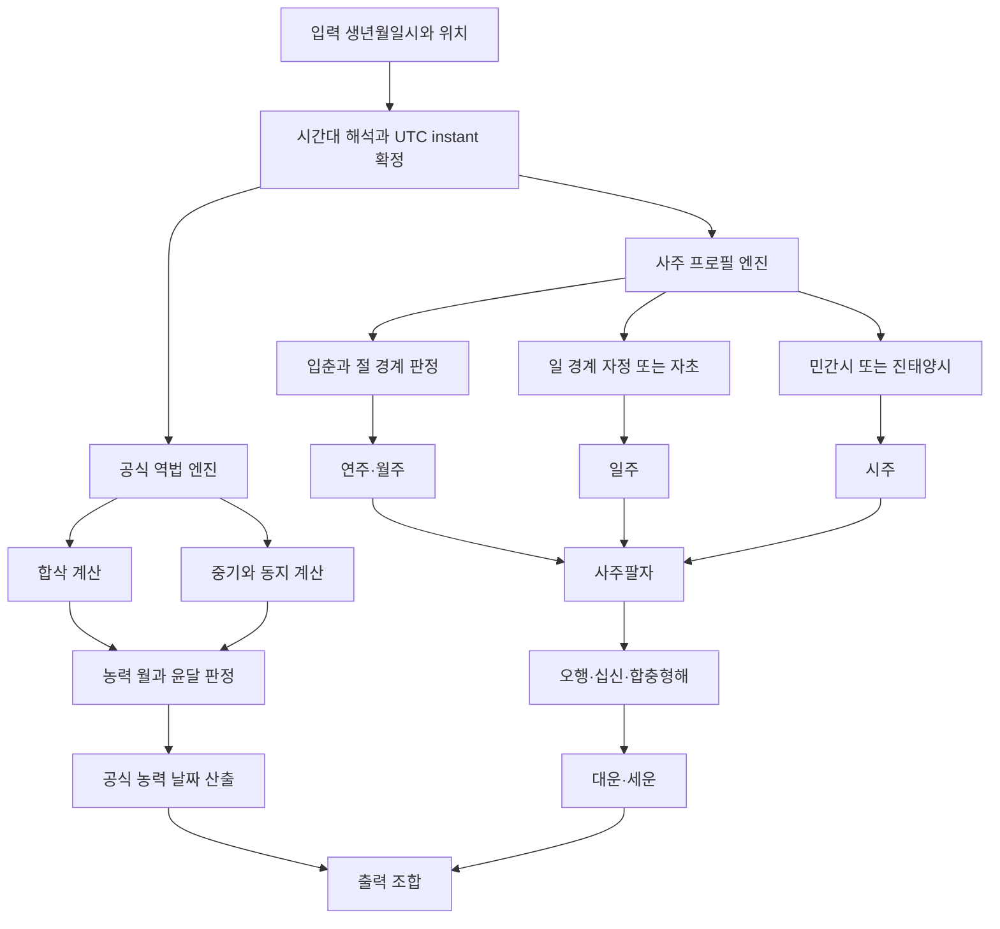

# 중국 만년력을 통한 사주 분석 알고리즘 개발 보고서

## 요약

중국 만년력을 기반으로 사주 분석 엔진을 만들 때는, **공식 역법 엔진**과 **사주 해석 엔진**을 분리하는 것이 핵심이다. 공식 역법 엔진은 중국의 농력 규칙을 엄밀히 구현해야 하며, 우선순위는 PRC 국가표준 **GB/T 33661-2017**, 자금산천문대 계열의 역서 자료, 그리고 홍콩천문대(HKO)의 공력-농력 대조 데이터와 API다. 이 층에서는 합삭(朔), 동지 포함 월, 중기(中氣) 부재 윤달, UTC+8 기준 시각 체계를 정확히 처리해야 하며, 그 위에 사주용 연주·월주·일주·시주 계산을 별도 규칙층으로 얹어야 한다. 특히 공식 농력은 “합삭이 들어 있는 날짜 전체”를 초하루로 잡는 반면, 사주 실무에서는 연·월 경계를 입춘/절(節)로, 일 경계를 자정 또는 자초(23:00)로 보는 학파 차이가 존재하므로, 한 개의 하드코딩 규칙으로 모든 사용 사례를 덮으면 반드시 충돌이 난다. citeturn6search0turn15search5turn27search1turn27search5turn55view1turn40view1

따라서 제품 설계의 정답은 “정답이 하나”가 아니라, **불변 규칙과 가변 프로필의 분리**다. 불변 규칙에는 육십갑자 순환, 절기·중기 계산, 윤달 판정, 천간·지지의 오행·음양 매핑, 십신 산출의 기본 관계식이 들어가고, 가변 프로필에는 입춘/설 경계, 자정/자초 환일, 민간시/진태양시, 대운 기산법, 오행 점수 가중치, 용신·격국 해석 규칙이 들어가야 한다. 학술적으로도 子平學 연구는 “일간을 명주로 삼는 기준”, “동지/입춘 환년”, “시간 좌표 기능”, “대운과 소운의 추배법”을 별도 쟁점으로 구분하고 있으며, 현대 논의 역시 단일한 국가표준 해석 체계로 수렴되어 있지 않다. citeturn49view0turn48search14turn35view0

실무적으로는 Python 또는 Rust 같은 범용 언어로 천문 계산 계층과 응용 계층을 분리하고, 시간대는 IANA tzdb, 윤초는 IERS Bulletin C를 참조하며, 공력-농력 검증은 HKO 공개 데이터와 자금산천문대/중국천문년력 계열 표를 “golden dataset”으로 운용하는 구성이 가장 안정적이다. 역사 시점의 입력, 특히 1929년 이전 중국 시각 체계나 pre-1970 타임존 데이터는 정확도 플래그를 별도로 달아야 한다. citeturn25view0turn25view1turn24search14turn24search15turn24search18turn23search26

## 공식 역법과 만년력 데이터 기반

중국 만년력 알고리즘의 기준은 “민속 달력 앱”이 아니라 **역법 표준과 공인 천문 자료**여야 한다. PRC의 현행 국가표준은 **GB/T 33661-2017 농력의 편산과 반행**이며, 자금산천문대 계열 자료는 1949년 이후의 현대 역서 계산과 베이징 시간 기준 절기 시각을 전제로 한 부록 표를 제공한다. 홍콩천문대도 공력-농력 대조표와 개방형 API를 제공하며, 장래 수십 년 뒤의 월상·절기 시각은 수분 단위 오차 때문에 자정 부근에서 날짜가 하루 달라질 수 있음을 공개적으로 경고한다. 즉, 만년력은 “정적인 lookup table”이 아니라 **천문 이벤트와 민간일 규칙이 결합된 계산 체계**로 봐야 한다. citeturn6search0turn8search4turn15search5turn27search1turn27search5

공식 달력층에서 가장 중요한 규칙은 네 가지다. 첫째, 계산의 현대 기준은 동경 120도와 UTC+8 체계다. 둘째, **중국력의 민간일은 자정에 시작**한다. 셋째, **합삭이 일어나는 날이 새 달의 초하루**이며, 합삭이 늦은 밤에 일어나더라도 그 날짜 전체가 새 달의 날짜로 처리된다. 넷째, 윤달 판정은 **중기와 동지 포함 월**을 기준으로 한다. 이 규칙은 1645년 이후의 현대 중국력 설명과 일치하며, 자금산천문대와 HKO 운영 자료도 같은 틀 안에서 움직인다. citeturn55view1turn55view2turn15search5turn27search1

1645년 시헌력 개혁은 단순한 역사적 배경이 아니라, 오늘날 알고리즘 설계의 분기점이다. 이 개혁에서 평균태양이 아니라 **진태양**을 사용하기 시작하면서 절기 간격이 비등분이 아니게 되었고, 그 결과 “중기가 없는 달”뿐 아니라 “한 달 안에 중기가 두 번 드는 달”도 가능해졌다. 바로 이 구조 때문에 윤달 판정이 단순한 19년 7윤 같은 순환식이 아니라, **실제 천문 시각 계산 기반의 판정**이 된다. 2033년 윤달 배치 오류가 1990년대 이전 달력들에서 널리 발생했던 것도 이 지점을 잘못 처리했기 때문이다. citeturn55view0turn55view1turn29search3turn29search5

이 관점에서 권장하는 만년력 내부 데이터 구조는 다음과 같다.

| 엔터티 | 핵심 필드 | 의미 |
|---|---|---|
| `AstronomicalEvent` | `event_type`, `jd_utc`, `local_dt_utc8`, `solar_longitude_deg`, `source_version` | 합삭, 절, 중기 같은 원천 이벤트 |
| `LunarMonth` | `start_new_moon_utc`, `start_date_utc8`, `month_no`, `is_leap`, `has_major_term`, `contains_winter_solstice` | 윤달 판정과 월번호 배정의 기본 단위 |
| `CalendarDay` | `gregorian_date_utc8`, `lunar_year`, `lunar_month`, `lunar_day`, `sexagenary_day` | 공식 농력 출력과 교차검증 단위 |
| `TimezoneContext` | `zone_id`, `utc_offset`, `is_dst`, `fold`, `historical_confidence` | 입력 생시 해석의 재현성 확보 |
| `RuleProfile` | `year_boundary`, `month_boundary`, `day_boundary`, `hour_basis`, `fortune_rule` | 사주 해석층의 학파별 설정 |

이 구조에서 중요한 포인트는 `LunarMonth.has_major_term`과 `contains_winter_solstice`를 별도 필드로 저장하는 것이다. 윤달은 월번호 자체가 아니라 **중기 포함 여부와 동지 포함 월의 상대 위치**에서 결정되므로, “윤7월” 같은 출력은 후처리 결과이지 원천 속성이 아니다. citeturn55view1turn55view2turn27search1

시간대와 역사 변동은 정확도 등급을 바꾸는 요인이다. Aslaksen의 수학적 정리는 1929년 이전에는 베이징 자오선(116°25′) 기반 계산이 쓰였고, 1928년 표준시 제도 채택 이후에는 120°E 기준이 들어섰으며, 1949년 이후 자금산천문대가 역산을 담당했다고 정리한다. 한편 IANA tzdb는 중국의 pre-1970 시간대 데이터가 부분적으로 불확실하다고 명시하고, Asia/Shanghai의 초기 표준시 전이와 1918~1949년 5표준시 프로젝트에 대한 주석을 둔다. 따라서 **근현대 이전 출생과 시간대 전환기 출생은 confidence를 낮추고, 사용자에게 명시적으로 고지**하는 것이 맞다. citeturn55view0turn55view1turn25view0turn25view1

국가 시간원은 중국과 국제 체계의 연결점이다. 중국 표준시의 국가 시간 기준은 국가수시중심(NTSC)이 담당하며, 국제적으로는 IERS가 Bulletin C를 통해 윤초 삽입 여부를 공고한다. 윤초는 자주 발생하지 않더라도, 생시를 “법적 타임스탬프”로 취급하는 시스템은 `23:59:60`을 파싱할 수 있어야 한다. 반대로 천문 계산 내부에서는 UTC instant를 정규화된 기준点으로 보관하고, 애플리케이션 레벨에서만 윤초 플래그를 유지하는 방식이 안전하다. citeturn23search26turn24search14turn24search15turn24search18

## 사주 이론과 표준화 쟁점

사주팔자 알고리즘의 이론적 중심은 **일간(日干)을 명주(命主)** 로 삼는 子平 계열 구조다. 정치대의 子平學 연구는 이것을 “고법이 년주를 중시한 것과 구별되는 子平推命의 핵심 특징”으로 요약하며, 이후의 궁위론·육친/십신 체계가 모두 여기서 전개된다고 본다. 또 2019년 석사논문은 十神의 핵심 이론을 “我剋, 剋我, 生我, 同我, 我生”의 다섯 기본 관계로 재구성하고, 이를 고전 문헌과 현대 저술을 통해 다시 십신으로 세분한다고 정리한다. 즉, 시스템이 산출해야 할 기본 축은 **일간, 타 간지와의 관계, 시간에 따른 운의 전개**다. citeturn48search2turn48search14turn35view0

전통 문헌 계보도 분명하다. 현대 소프트웨어에서 자주 참조되는 고전군은 《淵海子平》, 《三命通會》, 《子平真詮》, 《滴天髓》, 《五行精紀》 등이며, academic bibliography 역시 이 계보를 반복적으로 정리한다. 그 말은 곧, 사주 엔진의 “순수 계산부”는 현대적으로 구현하더라도, 해석 규칙은 결국 **고전-주석-현대 학파의 연쇄적 해석 전통** 위에 놓인다는 뜻이다. 따라서 어떤 해석을 “표준”이라고 부를 때는, 국가표준인지, 특정 학파 프로필인지, 설명용 기본값인지 명확히 구분해야 한다. citeturn49view0turn35view0

사주 구현에서 가장 먼저 정리해야 할 쟁점은 “무엇이 불변이고 무엇이 가변인가”다. 다음 표가 개발 관점에서 가장 실용적인 구분이다.

| 계층 | 상대적 안정성 | 구현 원칙 |
|---|---|---|
| 육십갑자 순환, 천간·지지의 음양·오행, 십신의 기본 관계식 | 높음 | 코어 로직으로 고정 |
| 연 경계 입춘 사용, 월 경계 절(節) 사용, 시지 12시진 분할 | 높음 | 기본 프로필로 제공 |
| 일 경계 자정 vs 자초, 시각 기준 민간시 vs 진태양시 | 중간 | 프로필 파라미터화 |
| 지장간 가중치, 강약 점수, 조후·병약·통관, 격국/용신 | 낮음 | 규칙 테이블 외부화 |
| 대운 기산법, 세운 환년, 해석 서술 템플릿 | 낮음 | 버전 명시와 선택형 제공 |

공식 농력 자료는 설날/음력월 기준으로 돌아가지만, 간지 기시법과 사주 실무는 보통 **입춘으로 환년**, **절(節)로 환월**하는 방향으로 구현된다. 수학적 분석 논문은 간지기년의 새해가 입춘에서 시작하고, 간지기월은 각 절기의 교절 시각에서 바뀐다고 명시한다. 동시에 같은 학술 계열 연구는 “동지/입춘 환년”, “시간 좌표 기능”을 공개된 쟁점으로 다루고 있어, 프로덕션 엔진에는 이 차이를 숨기지 말고 profile metadata로 드러내는 편이 낫다. citeturn40view0turn40view1turn49view0

십신 계산은 비교적 형식화하기 쉽다. 일간을 기준으로 상대 천간의 오행이 “같음·내가 생함·내가 극함·나를 극함·나를 생함” 가운데 어디에 놓이는지를 판정하고, 같은 관계 안에서 음양이 같으면/다르면 비견·겁재, 식신·상관, 편재·정재, 칠살·정관, 편인·정인으로 나눈다. 이 규칙은 현대 요약 자료와 학술 논문 양쪽에서 공통적으로 설명된다. citeturn32search5turn35view0

지지 상호작용은 기본 세트와 판정 세트를 분리하는 것이 좋다. **규칙 존재 자체** 는 비교적 안정적이다. 대학 자료와 논문 스니펫은 육합, 삼합, 육충, 삼형, 육해의 조합표를 거의 같은 형태로 제시한다. 그러나 “합이면 곧 化인가”, “충이 합을 해제하는가”, “형의 효력을 얼마나 강하게 보느냐”, “파를 핵심 규칙으로 볼 것인가”는 학파에 따라 훨씬 흔들린다. 그러므로 코어 엔진은 우선 **raw relation flag** 만 계산하고, 化·해격·용신 반영은 해석 프로필 단계에서 처리하는 것이 안정적이다. citeturn45search2turn45search4turn43search0turn49view0

## 간지 변환 알고리즘

권장 아키텍처는 한 문장으로 요약할 수 있다. **“공식 농력 변환”과 “사주용 사주기둥 변환”을 동일 입력에서 병렬 계산하되, 서로 다른 경계 규칙을 사용한다.** 공식 농력은 합삭·중기·동지와 UTC+8 민간일의 문제이고, 사주 기둥은 입춘·교절·일경계·시각기준의 문제다. 이 둘을 하나의 함수에 섞어 넣으면 윤달 입력, 입춘 직전 출생, 자시 출생, 해외 출생에서 버그가 난다. citeturn27search1turn55view1turn40view1

공식 농력 변환의 규칙은 다음처럼 구현하면 된다. 먼저 합삭 시각과 중기 시각을 천문 계산으로 구한다. 다음으로 **합삭이 들어 있는 UTC+8 날짜** 를 그 달의 초하루로 잡는다. 그런 뒤 동지가 들어 있는 농력월을 11월로 정하고, 한 삭망년(suì) 안에 13개월이 생기면 **중기가 없는 첫 달** 을 윤달로 표시한다. 이 로직은 현대 중국력의 핵심 규칙을 그대로 반영한다. citeturn55view1turn55view2turn27search1

사주용 연주와 월주는 공식 농력월과 다르다. 연주는 보통 **입춘 경계** 로 바꾸고, 월주는 각 월초 절기인 `立春, 驚蟄, 清明, 立夏, 芒種, 小暑, 立秋, 白露, 寒露, 立冬, 大雪, 小寒`의 교절 시각을 경계로 삼는다. 수학적 정식화로는 태양 겉보기 황경 `λ☉` 에 대해 `month_no = floor(((λ☉ - 315°) mod 360°) / 30°) + 1`로 월 번호를 정할 수 있고, 이때 1월은 寅월이다. 월간은 年上起月표를 쓰거나, 연간 인덱스를 이용한 동치식을 통해 산출하면 된다. citeturn40view0turn40view1turn3search6

일주는 검증된 기준일(anchor date)을 하나 잡고 60일 주기로 환산하는 방식이 가장 안정적이다. 학술적 정식화는 1901-02-14를 癸亥일로 쓰는 방법을 제시하고, 국가표준은 별도의 기준시점을 둔다. 구현에서는 어느 anchor를 택하든 좋지만, 반드시 **golden table과 교차검증된 기준일 하나** 만 사용해야 한다. 중요한 것은 anchor 그 자체보다, **선택한 anchor와 환일 규칙이 일관되게 버전 관리되는 것** 이다. citeturn40view0turn49view0

시주는 먼저 시지를 정하고, 그 다음 시간을 정한다. 시지는 로컬 시각을 기준으로 子시 `23:00–00:59`, 丑시 `01:00–02:59`처럼 12개 구간으로 나눈다. 시간은 일간 그룹별 자시 시작 간을 기준으로 순차 전개한다. 다만 자시 처리에서 학파 차이가 생긴다. 수학적 분석 논문은 간지기시법이 子시 시작점(23:00)을 날짜 경계로 보며, 이 때문에 같은 civil day 안에서도 **0시대 자시와 23시대 자시가 다른 일간 기준을 쓸 수 있다** 고 설명한다. 반면 공식 달력 규칙은 민간일을 자정에 바꾼다. 이 차이를 숨기면 23:00~23:59 출생의 일주·시주가 달라지는 버그가 생긴다. citeturn40view1turn55view1

시간대와 윤초 처리는 역법 엔진의 정확도보다도 더 자주 실패하는 부분이다. 입력은 반드시 `zone_id`를 가진 로컬 시각으로 받되, 내부 canonical key는 UTC instant로 보관하는 편이 좋다. DST가 있는 지역은 `fold` 값을 받아 반복되는 시간대를 구분해야 하며, IANA tzdb의 pre-1970 중국 데이터는 자체 불확실성이 있으므로 “historical confidence”를 함께 내보내는 것이 적절하다. 윤초는 IERS Bulletin C가 공표하는 공인 이벤트이므로, 파서가 `23:59:60`을 허용하지 못하면 `59 + leap_second_flag` 식으로 정규화하는 우회가 필요하다. citeturn25view0turn25view1turn24search14turn24search15turn24search18

진태양시(真太陽時)는 선택형이어야 한다. 공식 중국 농력은 UTC+8 민간일로 돌아가지만, 일부 사주 학파는 시주를 로컬 태양시에 맞춘다. 이 모드는 기본값이 아니라 `hour_basis = apparent_solar_time` 같은 명시적 profile로 제공하는 편이 좋다. 구현상으로는 민간시에 **경도 보정과 균시차** 를 더한 apparent solar time을 계산하고, 그 시각으로 시지와 자시 경계를 다시 평가하면 된다. 이는 공식 역법이 아니라 학파 옵션이므로, 결과 객체에 반드시 profile provenance를 붙여야 한다. citeturn47search1turn40view1turn55view1

## 오행·십신·대운 계산 로직

오행과 십신은 “계산 가능하지만 표준화 정도가 서로 다르다.” 십신은 일간을 기준으로 관계론적으로 결정되므로 비교적 안정적이지만, 오행 점수는 어느 층위까지 반영하느냐에 따라 크게 달라진다. 가장 보수적인 모델은 **겉으로 드러난 8자만** 세고, 중간 모델은 지장간을 포함하고, 강한 전통형은 월령, 통근, 투간, 조후, 격국을 함께 반영한다. 학술 연구와 전통 문헌 목차가 모두 `격국`, `용신`, `중화`, `通關`, `病藥`, `調候`를 별도 층으로 다루는 이유가 여기에 있다. 따라서 제품의 “오행 점수”는 하나가 아니라 **프로필별 점수 체계** 여야 한다. citeturn35view0turn49view0

실무용 기본 프로필로는 다음과 같은 3층 모델이 가장 설계 친화적이다. 먼저 `visible_score`는 8자 표면 글자에 동일 가중치를 준다. 다음 `hidden_score`는 지장간에 상대 가중치를 주되, 그 가중치 테이블은 외부 설정 파일로 둔다. 마지막 `seasonal_adjustment`는 월지와 월령을 반영해 계절 편향을 준다. 최종적으로 `element_score = a*visible + b*hidden + c*seasonal`처럼 프로필별 가중합을 내면, 설명 가능성과 유연성을 동시에 확보할 수 있다. 이는 “정설”이라기보다, 서로 다른 학파를 한 API 안에 공존시키기 위한 **소프트웨어 공학적 합의안** 이다. citeturn49view0

십신 계산 자체는 명확하다. 일간과 상대 천간의 오행 관계를 판별하고, 같은 음양/반대 음양을 나누면 된다. 예컨대 “내가 극하는 오행”은 재성이고, 같은 음양이면 편재, 다른 음양이면 정재다. 같은 원리로 내가 생하면 식상, 나를 생하면 인성, 나를 극하면 관살, 같으면 비겁이 된다. 시스템으로는 `tenGod(dayStem, otherStem)`을 순수 함수로 두고, 천간·지장간 모두에 재사용하는 구조가 가장 깨끗하다. citeturn32search5turn35view0

음양 균형은 굳이 신비화할 필요가 없다. 소프트웨어 관점에서는 각 표면 글자와 지장간에 음/양 플래그를 부여하고, 동일한 가중치 체계로 `yin_score`와 `yang_score`를 따로 계산하면 된다. 사용자에게는 절대값보다 **편향도** 를 보여주는 편이 낫다. 예를 들면 `imbalance = (yang - yin)/(yang + yin)` 또는 5구간 대역화(`매우 음성/음성/중성/양성/매우 양성`)가 해석과 UI 양쪽에서 모두 쓰기 쉽다. 이는 규칙이 아니라 표현 방식이므로, 해석 엔진이 아닌 presentation layer에서 처리하는 편이 바람직하다. citeturn49view0

합·충·형·해·파는 “관계 존재”와 “관계 해석”을 구분해야 한다. 육합, 삼합, 육충, 삼형, 육해의 기본 조합표는 비교적 안정적이므로 코어에서 계산해도 무방하다. 그러나 `합하면 화하는가`, `충이 월령을 깨는가`, `형의 위력을 얼마나 주는가`, `파를 독립 변수로 볼 것인가`는 해석학파 의존성이 강하다. 따라서 출력은 `raw_relations[]`와 `interpreted_effects[]`로 나누는 것이 좋다. 전자는 결정론적이고, 후자는 profile 종속적이다. citeturn45search2turn45search4turn49view0

대운과 세운은 UI보다도 정책 설계가 어렵다. 가장 널리 쓰이는 전통 규칙은 **양남음녀 순행, 음남양녀 역행** 이며, 출생 시각에서 다음 또는 이전 절까지의 차이를 세어 `3일 = 1년`, `1일 = 4개월`, `1시간 = 10일`로 환산해 기산 연령을 잡는다. 다만 학술 연구는 대운·소운의 추배법을 별도 쟁점으로 다루고, 현대서마다 세부식이 다르다. 그러므로 엔진은 `fortune_profile`을 따로 두고, 성별/젠더 값을 자동 추론하지 말며, 필요한 경우 사용자에게 **방향 규칙을 직접 선택** 하게 하는 편이 윤리적으로도 안전하다. citeturn50search0turn49view0

세운은 더 단순하다. 대부분의 구현은 대운과 동일한 연경계 규칙, 즉 **입춘 환년** 을 사용해 해당 운년의 연주를 구하고, 이를 원국과 대운에 중첩해 해석한다. 중요한 것은 “공식 설날 기준 연도”와 “사주용 입춘 기준 연도”를 혼동하지 않는 것이다. 같은 2025-02-03이라도 22:10:28 전후로 연주와 월주가 바뀔 수 있기 때문이다. 이 구간은 UI에서 “경계 시각”으로 강조 표시해야 한다. citeturn40view0turn40view1

## 데이터·API·테스트 설계

입력과 출력은 해석보다 먼저 표준화해야 한다. 좋은 API는 “무엇을 계산했는가”보다 **“어떤 규칙으로 계산했는가”** 를 더 많이 드러낸다. 권장 입력 스키마는 `birth_datetime_local`, `zone_id`, `latitude`, `longitude`, `calendar_input_mode`, `lunar_leap_flag`, `profile_id`, `hour_basis`, `day_boundary_mode`, `fortune_profile`, `sex_for_fortune_rule` 정도다. 특히 `calendar_input_mode=lunar` 인 경우에는 **윤달 플래그를 필수** 로 받아야 한다. 2023년 윤2월, 2025년 윤7월처럼 중복 월번호가 존재하는 해에는 “2월 4일” 같은 문자열만으로는 날짜를 결정할 수 없기 때문이다. 이 모호성은 사용자 UX가 아니라 역법의 본질이다. citeturn27search1turn15search5

권장 출력은 다음과 같은 구조를 가지는 편이 좋다.

| 출력 그룹 | 필드 예시 | 설명 |
|---|---|---|
| `canonical` | `instant_utc`, `resolved_local_datetime`, `zone_id`, `fold` | 입력 시각 정규화 |
| `official_calendar` | `lunar_year`, `lunar_month`, `is_leap_month`, `lunar_day` | 공식 중국 농력 |
| `pillars` | `year`, `month`, `day`, `hour` | 사주 4주 |
| `analysis_core` | `day_master`, `ten_gods`, `five_elements`, `yin_yang_balance`, `raw_relations` | 결정론적 분석 |
| `fortune` | `dayun_direction`, `dayun_start_age`, `dayun_cycles`, `seun_year_pillar` | 운세 계산 |
| `meta` | `profile_id`, `ambiguities`, `boundary_distance_sec`, `source_versions`, `confidence` | 재현성과 고지 |

이 스키마의 핵심은 `meta`다. 사주 시스템은 경계 규칙이 다르기 때문에, 결과만 저장하면 나중에 재현이 안 된다. 반드시 `profile_id`, `hour_basis`, `day_boundary_mode`, `source_version`을 함께 기록해야 한다. citeturn25view0turn25view1turn24search14turn27search5

예외와 오류는 “잘못된 입력”과 “유효하지만 모호한 입력”을 나눠야 한다. 아래는 권장 예외 세트다.

| 코드 | 유형 | 처리 원칙 |
|---|---|---|
| `LEAP_MONTH_FLAG_REQUIRED` | 유효하지만 미완성 | 윤달 여부 재입력 요구 |
| `NONEXISTENT_LOCAL_TIME` | 잘못된 로컬 시각 | DST spring-forward 구간 등 |
| `AMBIGUOUS_LOCAL_TIME_FOLD_REQUIRED` | 유효하지만 모호 | DST fold 지정 요구 |
| `BOUNDARY_PROXIMITY_WARNING` | 유효하지만 경계 근접 | 입춘·교절·합삭 ±N초 경고 |
| `PRE1970_TZ_UNCERTAIN` | 유효하지만 기초자료 불안정 | confidence 하향 |
| `LEAP_SECOND_NORMALIZED` | 유효하지만 특수 파싱 | 윤초 플래그 기록 |
| `PROFILE_REQUIRED_FOR_FORTUNE_DIRECTION` | 정책 미지정 | 대운 방향 rule 선택 요구 |

이 표의 상당수는 tzdb, IERS, HKO가 실제로 인정하는 데이터 조건에서 직접 나온다. 즉, 모호성은 개발자가 만든 문제가 아니라 **시간 체계와 역법 체계가 원래 가진 속성** 이다. 

테스트는 단순한 unit test로 끝나지 않는다. 다음과 같은 회귀군이 필요하다.

| 테스트군 | 대표 케이스 | 기대 |
|---|---|---|
| 윤달 중복월 | 2023년 2월 4일, 2025년 7월 10일의 음력 입력 | 윤달 플래그 없으면 오류 |
| 입춘 경계 | 2025-02-03 22:10:28 Asia/Shanghai 전후 1초 | 연주·월주만 전환되는지 확인 |
| 자시 경계 | 23:00~23:59 출생 | 자정/자초 profile 차이 명시 |
| 합삭 자정 근접 | HKO가 지목한 2057, 2089, 2097 사례 | 경고 또는 confidence 하향 |
| Y2033 회귀 | 2033~2034 윤달 배치 | 검증표와 일치 |
| 역사 시각 | pre-1970 China, pre-standard-time 출생 | `PRE1970_TZ_UNCERTAIN` |
| 윤초 파싱 | 공인 leap-second timestamp | 정규화 성공 |

이 중 2057·2089·2097은 HKO가 미리 날짜 오차 가능성을 언급한 장래 사례이고, 2033 문제는 중국력 구현 역사에서 고전적인 회귀 버그다. 따라서 이 케이스들은 단순 edge case가 아니라 **반드시 고정 회귀세트에 들어가야 하는 canonical test** 다.

## 구현 권장안과 샘플 계산

구현 스택은 언어보다 계층 분리가 중요하다. 실무적으로는 **Python** 이 연구·검증 속도에서 유리하고, **Rust** 는 배포형 API 서버에서 재현성과 성능에 유리하다. 어떤 언어를 택하든 구조는 비슷해야 한다. `time` 계층은 IANA tzdb, `astronomy` 계층은 고정밀 태양·달 위치 계산 라이브러리, `calendar` 계층은 합삭·중기·동지 기반 공식 농력, `bazi` 계층은 profile-driven 연·월·일·시주 계산, `interpretation` 계층은 오행·십신·대운·서술 생성으로 나누는 편이 좋다. 이 구조를 지키면 학파별 규칙 추가와 회귀 테스트가 쉬워진다. 

정확성 검증은 “라이브러리가 맞다”가 아니라 “공인 표와 일치한다”로 해야 한다. 첫째, HKO 공력-농력 대조 데이터와 API를 golden test로 사용한다. 둘째, 자금산천문대/중국천문년력 부록 표를 대조 세트로 둔다. 셋째, 입춘·교절·합삭·윤달 시작점 전후 ±1초 fuzz test를 돌린다. 넷째, 같은 instant에 대해 `midnight profile`, `zi-first profile`, `true-solar profile`이 각각 예측 가능한 차이를 내는지 differential test를 만든다. 다섯째, 역사 구간은 tzdb 버전 업데이트 때마다 회귀를 다시 돈다.

아래 표는 **기본 프로필** 로 재계산한 예시다. 기본 프로필은 `공식 농력=UTC+8 중국력`, `연주/월주=입춘·절 기준`, `일경계=자정`, `시주=로컬 민간시`, `오행 기본점수=표면 8자 1점 모델` 이다.

| 사례 | 입력 | 공식 농력 | 사주 | 천간 십신 요약 | 오행 기본점수 | 경계 포인트 |
|---|---|---|---|---|---|---|
| 윤달 예시 A | 2023-03-25 12:00 Asia/Shanghai | 2023년 윤2월 4일 | 癸卯 / 乙卯 / 壬午 / 丙午 | 연간 겁재, 월간 상관, 시간 편재 | 목3/화3/토0/금0/수2 | 2023년 중국 공식 윤2월 구간 |
| 윤달 예시 B | 2025-09-01 12:00 Asia/Shanghai | 2025년 윤7월 10일 | 乙巳 / 甲申 / 癸酉 / 戊午 | 연간 식신, 월간 상관, 시간 정관 | 목2/화2/토1/금2/수1 | 2025년 중국 공식 윤7월 구간 |
| 입춘 직전 | 2025-02-03 22:09 Asia/Shanghai | 2025년 1월 6일 | 甲辰 / 丁丑 / 癸卯 / 癸亥 | 연간 상관, 월간 편재, 시간 비견 | 목2/화1/토2/금0/수3 | 입춘 1분 29초 전 |
| 입춘 직후 | 2025-02-03 22:11 Asia/Shanghai | 2025년 1월 6일 | 乙巳 / 戊寅 / 癸卯 / 癸亥 | 연간 식신, 월간 정관, 시간 비견 | 목3/화1/토1/금0/수3 | 입춘 31초 후 |

위 네 사례는 “공식 농력 날짜는 그대로인데, 사주의 연주·월주가 입춘 경계에서 바뀐다”는 점을 잘 보여준다. 특히 2025-02-03 22:09와 22:11은 불과 2분 차이지만, 연주와 월주가 동시에 전환된다. 이런 구간에서는 UI에 `boundary_distance_sec`와 함께 “경계시각 근접” 경고를 반드시 노출해야 한다. 표의 값은 본 보고서의 기본 프로필로 재계산한 결과다.

자시 경계는 별도 표로 보는 것이 낫다.

| 입력 | 프로필 | 사주 |
|---|---|---|
| 2025-02-03 23:30 Asia/Shanghai | 자정 환일 | 乙巳 / 戊寅 / 癸卯 / 壬子 |
| 2025-02-03 23:30 Asia/Shanghai | 자초 환일 | 乙巳 / 戊寅 / 甲辰 / 甲子 |

같은 순간에도 `day_boundary_mode`를 무엇으로 두느냐에 따라 일주와 시주가 함께 달라진다. 따라서 결과를 저장할 때 사주 문자열만 저장하는 것은 불충분하고, **반드시 profile 전체를 함께 저장** 해야 한다.

## 법적·윤리적 고려

사주 서비스는 겉으로 보기보다 개인정보 밀도가 높다. 이름이 없어도 **출생일시와 출생지** 는 개인 식별 가능성이 매우 높고, 중국의 개인 정보 보호 해설 자료와 민사법 해설은 출생일을 명시적으로 개인정보 범주에 포함한다. 한국 개인정보보호 체계도 정보주체의 동의·고지·선택권을 강조하고, 유출 발생 시 일정 요건에서 72시간 내 통지·신고 의무를 둔다. 따라서 최소 수집, 명시적 동의, 저장 기간 제한, 암호화, 접근 통제, 감사 로그, 삭제 요청 대응은 “있으면 좋은 기능”이 아니라 기본 요구사항이다.

문화적 민감성도 중요하다. 子平學 연구 자체가 이 체계를 하나의 역사적·모형적 사고 체계로 다루면서도 그 한계를 명시하고 있으며, 현대 서비스가 이를 그대로 “과학적 예측”처럼 제시하는 것은 부적절하다. 사용자 고지 문구에는 최소한 다음 네 문장이 들어가야 한다. 이 결과는 전통 문화 해석 모델이며 과학적 진단이 아니다. 결과는 선택한 규칙 프로필에 따라 달라질 수 있다. 역사 시점과 경계 시각에서는 불확실성이 커질 수 있다. 의료·법률·재무·고용 판단에 직접 사용해서는 안 된다. citeturn49view0

특히 전통 규칙 가운데는 현대 서비스에 그대로 노출하면 문제가 되는 항목이 있다. 성별에 따라 대운 순·역행을 나누는 규칙, 혼인·출산·질병·수명 같은 민감 주제를 단정적으로 서술하는 규칙, 특정 관계를 흉조로 낙인찍는 표현이 그렇다. 제품 설계에서는 **성별/젠더를 자동 추론하지 말고**, 필요하면 “전통 규칙상 어떤 방향 공식을 쓸지”를 별도 설정값으로 분리하는 편이 낫다. 또한 음성적 사건 예측은 기본 비활성화하고, 사용자가 원해도 경고와 맥락 설명 없이 단정형 문장으로 출력하지 않는 것이 바람직하다. citeturn50search0turn49view0

종합하면, 중국 만년력을 통한 사주 분석 알고리즘 개발의 핵심은 “점술을 코딩한다”가 아니라 **공식 역법의 불변 코어와 전통 해석의 가변 프로필을 분리하고, 그 차이를 사용자에게 숨기지 않는 것** 이다. 그렇게 해야만 계산은 엄밀해지고, 해석은 버전 관리가 가능해지며, 법적·윤리적 위험도 줄어든다.